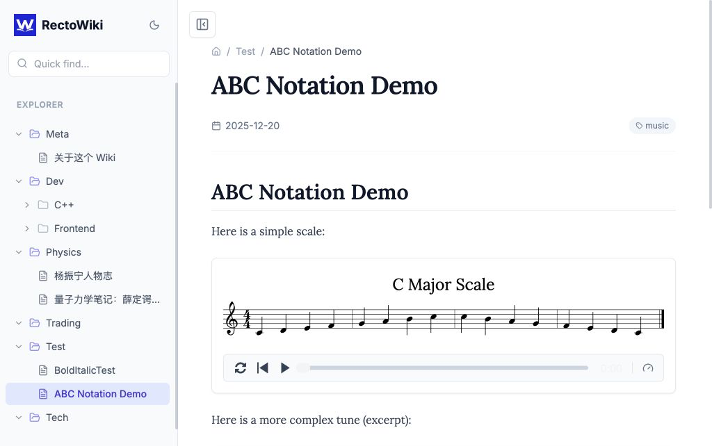
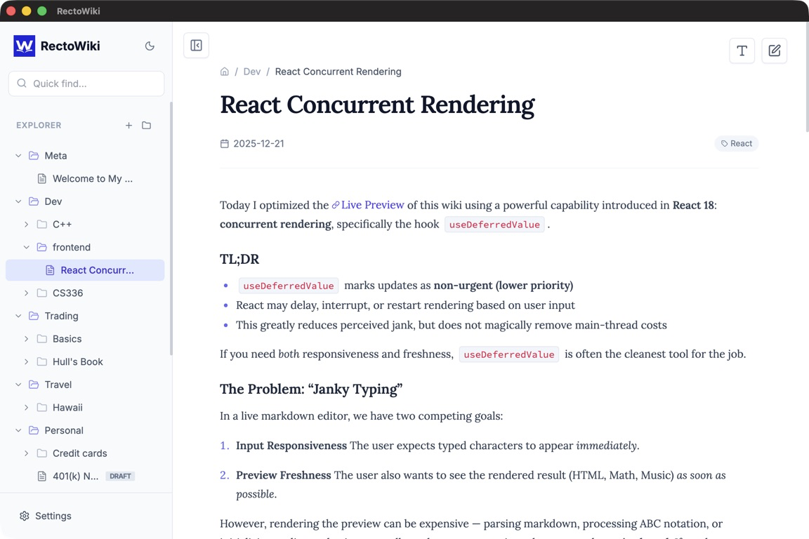
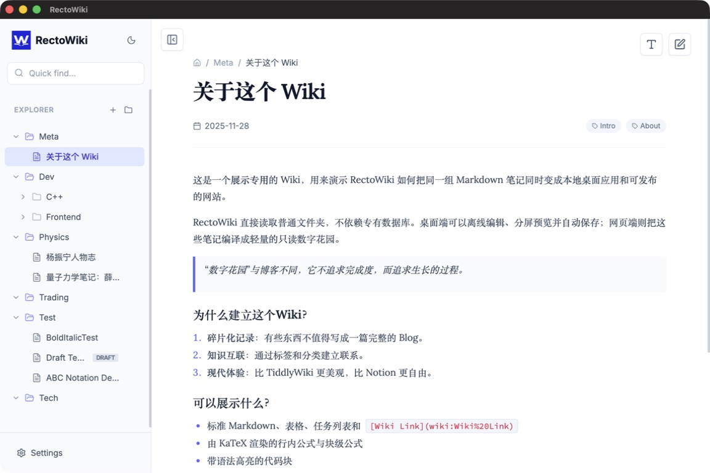

<div align="center">
  
  <h1>RectoWiki</h1>
  <p><b>A local-first Markdown wiki that is both a desktop editor and a publishable website.</b></p>
  <p>
    <a href="https://github.com/EtoDemerzel0427/RectoWiki/releases">
      
    </a>
    <a href="https://github.com/EtoDemerzel0427/RectoWiki/actions/workflows/deploy.yml">
      
    </a>
  </p>
  <p>
    <a href="https://github.com/EtoDemerzel0427/RectoWiki/releases"><b>Download the desktop app for macOS, Windows, or Linux</b></a>
  </p>
</div>

RectoWiki uses ordinary Markdown files as its source of truth. The Electron desktop app edits a folder on your computer directly; the same folder can be compiled by Vite and published as a fast, read-only digital garden. There is no proprietary note database and no required cloud service.

<p align="center">
  
  
</p>

## Features

### Rich Markdown reading

- GitHub Flavored Markdown, tables, task lists, and external links
- `[[Wiki Link]]` navigation between notes
- LaTeX mathematics rendered with KaTeX
- Syntax-highlighted code blocks loaded on demand
- ABC music notation with responsive sheet music and audio playback
- Tags, dates, categories, configurable home page, and per-page appearance metadata
- Full-text search, tag filtering, dark mode, responsive navigation, and shareable hash links

### Local-first desktop editing

- Choose any local folder as the wiki content directory
- Side-by-side live preview and Markdown editor with a resizable divider
- Frontmatter fields for title, date, tags, category, and draft status
- Manual save or debounced automatic save using atomic file replacement
- Create, rename, delete, reorder, and drag notes or folders in the tree
- Automatic refresh when Markdown files or configuration change on disk
- Global and per-page font themes and content sizes
- Works offline after installation

### Static web publishing

- Converts the content tree into a static JSON index during the build
- Lazy-loads heavy renderers so ordinary pages start faster
- Supports subpath deployments such as GitHub Pages project sites
- Includes a GitHub Actions workflow that deploys `main` to GitHub Pages

## Quick start

RectoWiki requires Node.js 20 or newer and npm.

```bash
git clone https://github.com/EtoDemerzel0427/RectoWiki.git
cd RectoWiki
npm ci
npm run dev
```

The web development server is available at `http://localhost:5173/`.

To run the desktop editor during development:

```bash
npm run electron:dev
```

## Writing content

Add Markdown files below `content/`. Subdirectories become folders in the navigation tree.

```markdown
---
title: My Note
date: 2026-08-08
tags: [reference, example]
category: Notes
draft: false
---

# My Note

Link to [[Another Note]], write math such as $E = mc^2$, or add a fenced code block.
```

Generate the browser-readable content index and build the static site with:

```bash
npm run build
```

In desktop mode, RectoWiki watches the selected content directory and reflects file changes automatically. New pages are created as local drafts under the sibling `.rectowiki/drafts/` directory. Drafts are shown in the desktop app with a `Draft` badge and can be previewed normally, but they are not copied to a static deployment. Uncheck **Draft** and save to move a draft into `content/` and make it eligible for publishing.

## Desktop app



Build native installers with:

```bash
npm run electron:build
```

Artifacts are written to `dist_electron/`. Release tags matching `v*` trigger the multi-platform release workflow.

> Unsigned macOS builds may be quarantined after download. If you trust the artifact you built or downloaded, remove the quarantine attribute with `xattr -cr /Applications/RectoWiki.app`.

## Publish your notes with GitHub Pages

1. Fork this repository and place your Markdown files in `content/`.
2. In the repository settings, choose **GitHub Actions** as the Pages source.
3. Push to `main`. The included workflow generates the content index, builds the site, and deploys `dist/`.
4. Point the desktop app's **Content Location** setting at that same `content/` folder. Local drafts live beside it in `.rectowiki/drafts/`, which is ignored by Git; commit and push only when you want to publish local edits.

The `draft: true` frontmatter flag is also filtered during static generation as a second safety boundary. A draft that is accidentally left under `content/` will still be excluded from the published `content.json`, but files committed to a public repository remain visible in Git history.

For Netlify or Vercel, use `npm run build` as the build command and `dist` as the output directory.

## Scripts

| Command | Purpose |
| --- | --- |
| `npm run dev` | Start the Vite development server |
| `npm run gen-content` | Regenerate `public/content.json` from Markdown |
| `npm run build` | Generate content and build the static website |
| `npm run preview` | Preview the production web build |
| `npm run electron:dev` | Run Vite and Electron together |
| `npm run electron:build` | Build the website and native installers |
| `npm test` | Run the Vitest suite |
| `npm run lint` | Run ESLint |

## Project structure

```text
RectoWiki/
├── content/                 # Markdown notes and wiki configuration
├── .rectowiki/drafts/       # Local-only drafts (ignored by Git)
├── docs/images/             # README screenshots
├── electron/                # Desktop main process and content watcher
├── public/
│   ├── content.json         # Generated web content index
│   ├── logo.png             # Web, favicon, and packaged app icon
│   └── screenshot.png       # Desktop overview used in this README
├── scripts/                 # Static content generation
├── src/                     # React interface and Markdown renderers
├── .github/workflows/       # Pages deployment and native releases
└── package.json
```

## Customization

- Set the wiki title, home page, global font theme, and content size in the desktop settings.
- Replace `public/logo.png` to update the sidebar, mobile header, favicon, README, and packaged application icon together.
- Edit `src/index.css` and `tailwind.config.js` for deeper visual changes.

## License

MIT
